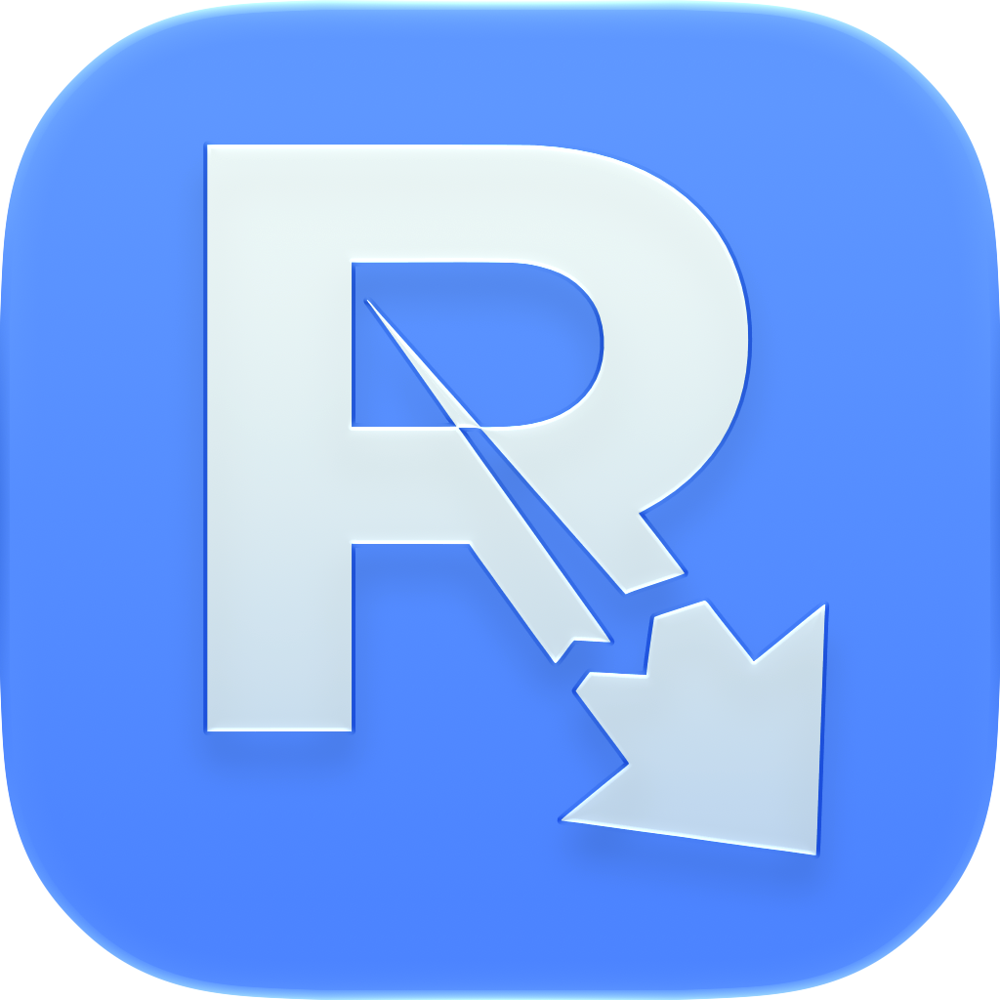

# ⚡ ripr — Modern Video & Audio Downloader for macOS

<p align="center">
  
</p>

<p align="center">
  <b>100% native macOS SwiftUI App</b> mit direkter Anbindung an modernstes <b>yt-dlp</b> und statisches <b>FFmpeg</b>.
</p>

<p align="center">
  
  
  
</p>

---

## ✨ Highlights & Features

- 🍎 **Echtes macOS Design (SwiftUI)**:
  - Dynamische Farbanpassung an die erkannte Plattform (YouTube, Twitch, TikTok, Instagram, Kick, etc.).
  - Echte macOS Systemtransparenzen, Inset Cards, Retina Icons und flüssige Animationen.
  - Native Thumbnail-Vorschau mit Kanalname, Videolänge und automatischer Video- & Audio-Formatauswahl.
  - Blitzschneller Start (unter 0,1 Sekunde) ohne Python-GUI-Overhead.

- 📦 **100% Standalone (Keine Abhängigkeiten)**:
  - Enthält native Apple Silicon Binaries für `yt-dlp`, `ffmpeg` und `ffprobe`.
  - Nutzer benötigen **weder Homebrew noch Python** auf ihrem Mac.

- 🔄 **Stille Hintergrund-Updates für yt-dlp**:
  - `ripr` prüft im Hintergrund automatisch (und ressourcenschonend alle 12h) nach den neuesten `yt-dlp` Versionen, sodass Downloads auch bei Plattform-Änderungen nie abbrechen.

- ⏱️ **Echtzeit-Fortschritt & ETA**:
  - Verbleibende Restzeit (`Noch ca. 15 Sekunden`).
  - Dateigröße, geladene Megabytes und Download-Geschwindigkeit.
  - Button für Abbruch und direkter Klick auf `📂 Im Finder anzeigen`.

- 🟣 **Twitch Live-Stream Recording**:
  - Erkennt laufende Live-Streams automatisch mit Live-Aufnahmetimer.
  - Sauberes Beenden mit Speicherung einer fehlerfreien MP4-Datei.

- 🍪 **Intelligente Cookie-Verwaltung**:
  - Unterstützt Browser-Cookies (Safari, Chrome, Firefox, Brave).
  - Instagram Reels ohne Login-Wall, YouTube automatisch optimiert gegen Bot-Sperren.

---

## 🚀 Installation & Download

Lade die neueste Version einfach von der [Releases-Seite](https://github.com/lennart168/ripr/releases) herunter:

1. Lade die Datei **`ripr.dmg`** herunter.
2. Öffne die `.dmg`-Datei per Doppelklick.
3. Ziehe **`ripr.app`** in den **`Applications`** (Programme) Ordner.
4. **Erster Start auf macOS**:
   - Da die App quelloffen ist und ohne kostenpflichtiges Apple-Entwicklerzertifikat verteilt wird, mache beim ersten Start einen **Rechtsklick** auf `ripr.app` in deinen Programmen ➔ **Öffnen** ➔ Bestätigen.

---

## 🛠️ Für Entwickler: Aus dem Quellcode bauen

### 1. Binaries herunterladen
Falls du das Repository frisch geklont hast, lade einmalig die benötigten Binaries herunter:
```bash
./setup_binaries.sh
```

### 2. App kompilieren
```bash
./build_swift.sh
```
Die fertige App liegt nun unter `ripr.app`.

### 3. DMG erstellen
```bash
./create_dmg.sh
```
Erstellt das fertige `ripr.dmg` für die Weitergabe.
